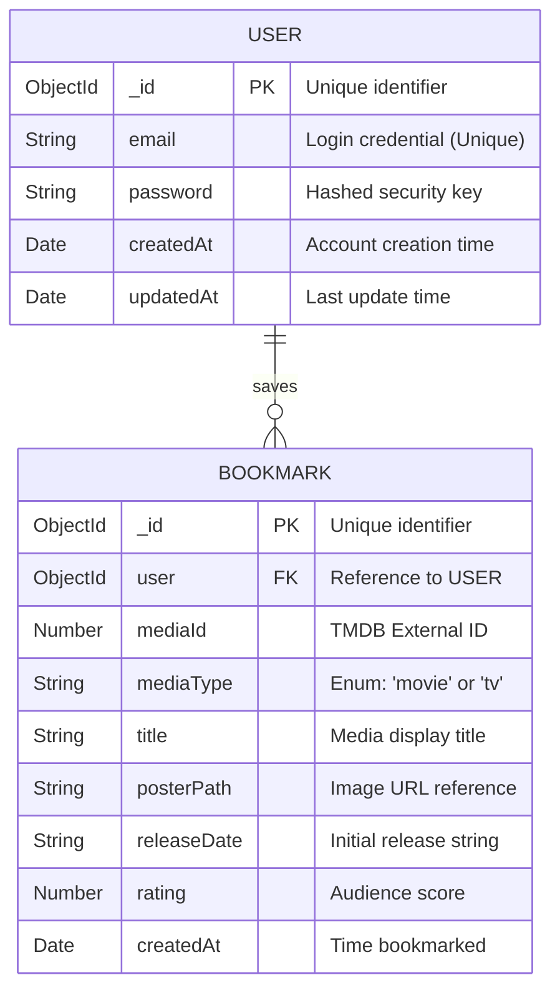

# Database Architecture: Entertainment App

> [!NOTE]
> This document outlines the database architecture for the Entertainment App. The application utilizes **MongoDB**, a highly scalable NoSQL database. The schema is strictly typed and managed using **Mongoose** (an Object Data Modeling library for Node.js).

## 📊 Entity-Relationship Diagram

The diagram below illustrates the structural relationship between our two core data entities.

---

## 🗄️ Detailed Schema Breakdown

### 👤 `Users` Collection
> [!IMPORTANT]
> The `Users` collection is responsible for handling authentication and identity. For security, passwords are automatically encrypted (hashed and salted) using `bcrypt` via Mongoose middleware before they are ever saved to the database.

| Field Name | Data Type | Constraints & Properties | Description |
| :--- | :--- | :--- | :--- |
| **`_id`** | `ObjectId` | Primary Key, Auto | The unique, primary identifier automatically generated by MongoDB. |
| **`email`** | `String` | Required, Unique | The user's email address, acting as the unique username for login. |
| **`password`**| `String` | Required, Hashed | The user's secure password. |
| **`createdAt`**| `Date` | Auto-generated | The exact timestamp when the user registered. |
| **`updatedAt`**| `Date` | Auto-generated | The exact timestamp of the last modification to the user's record. |

 

### 🔖 `Bookmarks` Collection
> [!TIP]
> The `Bookmarks` collection caches essential metadata from the external TMDB API. Storing fields like `title` and `posterPath` locally prevents the app from having to make additional API calls just to render the user's saved list, significantly improving performance.

| Field Name | Data Type | Constraints & Properties | Description |
| :--- | :--- | :--- | :--- |
| **`_id`** | `ObjectId` | Primary Key, Auto | The unique identifier for the specific bookmark entry. |
| **`user`** | `ObjectId` | Foreign Key, Required | References the `_id` of the user who saved the item. |
| **`mediaId`** | `Number` | Required | The unique identifier mapped directly to the external TMDB database. |
| **`mediaType`**| `String` | Required | Classifies the media item. Only accepts `"movie"` or `"tv"`. |
| **`title`** | `String` | Required | The full text title of the movie or TV show. |
| **`posterPath`**| `String` | Optional | The relative path string to fetch the poster image from TMDB. |
| **`releaseDate`**| `String`| Optional | The official release date formatted as a string. |
| **`rating`** | `Number` | Optional | The community vote average or rating score. |
| **`createdAt`**| `Date` | Auto-generated | The timestamp of when the user added the bookmark. |
| **`updatedAt`**| `Date` | Auto-generated | The timestamp of the last update to this specific bookmark. |

---

## 🔗 Relationships & Querying Explained

> [!NOTE]
> **One-to-Many Relationship (1:N)**
> A single **User** can have many **Bookmarks**, but a single **Bookmark** strictly belongs to one **User**.

When a user logs in and navigates to their bookmarked page, the backend executes a query against the `Bookmarks` collection filtering by the `user` field (the logged-in user's `_id`). Because the bookmark document contains all the necessary visual data (title, image, rating), the frontend can render the user's entire watchlist immediately without needing to cross-reference the external TMDB API.
